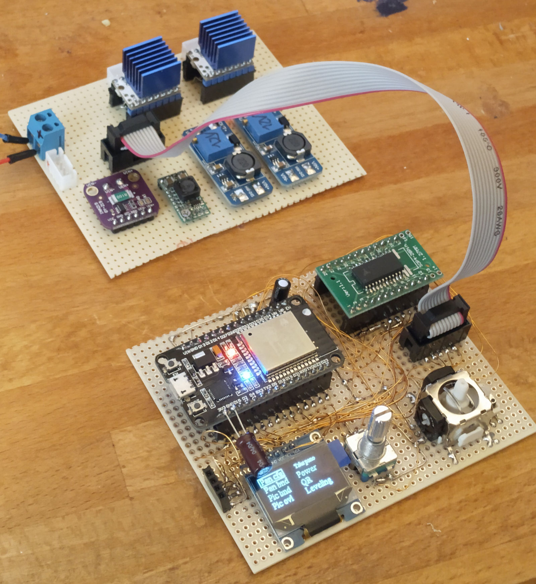

# panohead-ng

Motorized panoramic head based on

## Current prototype setup

- [ESP32 WROOM](https://www.espressif.com/en/products/hardware/esp-wroom-32/overview) (dual core) as controller.
- [TMC429](https://www.trinamic.com/fileadmin/assets/Products/ICs_Documents/TMC429_datasheet.pdf) (ramp generator) for smooth and software independent realtime movement of the stepper motors.
  - ESP works as clock source.
- [TMC2208](https://shop.watterott.com/SilentStepStick-TMC2208_1) (stepper driver) modules.
  - Low noises.
  - Low power cause of coolstep.
  - Available as 3D printer compatible module.
- [Stepper 11HS12-0674D1-PG27](https://www.omc-stepperonline.com/download/11HS12-0674D1-PG27.pdf) (NEMA 11, ~27:1 gearbox, 0.67A, 5.6ohms).
- Additional GT2 belt gear 1:5 to increase torque and reduce backlash.
- Optocouplers for Focus/Trigger.
- [ADS1115](http://www.ti.com/lit/ds/symlink/ads1115.pdf) (I²C 4-channel ADC) for joystick, ~~battery voltage and current.~~ This will do INA219.
- ~~Joystick read via [ESP32 ADC](https://randomnerdtutorials.com/esp32-adc-analog-read-arduino-ide/).~~ ESP32 ADC is horrible bad, extremely noisy (up to +-10% of value!!) and ist even to bad for a joystick. The real resolution with capacitors and filtered supply voltage are 5..6Bits.
- [INA219](http://www.ti.com/lit/ds/symlink/ina219.pdf) (I²C current and voltage sensor, 12Bit resolution) for battery voltage and current.
- OLED Display (I²C) for menu and status.
  - 128x64 Pixel
- Rotary encoder with knob for menu.
- Analog console joystick for jogging.
- Some status LED's for focus, trigger, ...
- [MPU9255](https://stanford.edu/class/ee267/misc/MPU-9255-Datasheet.pdf) (I²C; 3-Axis gyroscope, 3-Axis accelerometer,3-Axis magnetometer) for motion sensing.
- [PlatformIO](https://platformio.org/) / Arduino for software.
- Maybe [Angular](https://angular.io/) (10+ with ivy) and websockets on JSON base for remote interfacing.

## Power supply

- Battery from [4 - 12.6]V (4-8 NiMH or 2-3 LiPo in series).
  - Single NiMH cell [1 - 1.5]V.
  - Single LiPo cell [2.5 - 4.2]V.
- 2 x Step-Up (to ~12V) module based on [MT3608](https://prom-electric.ru/media/MT3608.pdf) to power stepper driver.
- Step Down (to ~3.3V) module based on [MP2315](https://www.monolithicpower.com/en/documentview/productdocument/index/version/2/document_type/Datasheet/lang/en/sku/MP2315/document_id/513/) to power logic.

## Multible Modules

### Stepper Module (one for every axis)

Close to the stepper Motor.

Connections to main module: GND, V_bat, !EN_V_m, !EN_stepper, Step, Dir, Uart

- TMC2208 Driver.
- Step up MT3608 Module for TMC2208 V_m.
- Linear 3.3V AMS1117-3.3 for TMC2208 V_io connected to V_m or V_bat.
- Big capcitor for V_bat.

### Camera Module

Close to the camera as possible for short trigger cable and good movement detection.

Connections to main module: GND, V_33, DSA, SCL, Focus, Trigger

- I²C Movement detection: MPU9255.
- Focus/Trigger Plug: 3,5mm stereo earphone plug.
- Optocouplers to keep cam save: with transistor output and low leakage current.

### Development Module

Connections to main module: GND, V_33, !EN, !RESET, TX, RX

- CH340 USB to serial converter.
- !EN/!RESET logic (2 transistors and capacitor on !EN).
- 3.3V Step down V_usb to V_33: MP2315 based module.
- USB-Connector
- Programming connector.

### Main Module

Connection to stepper module X, stepper module Y, cam module, battery

- Power.
  - I²C Current/Voltage/Power meter: INA219.
  - Step down V_bat to V_33: MP2315 based module.
  - Voltage Supervisor: see TODO section.
- Controller.
  - ESP32 dual core 240MHz, 16Mbit flash (WROOM module).
    - Programming connector.
    - [JTAG connector].
    - 'Reset' and 'Program' Button.
  - SPI Stepper controller: TMC429.
  - [SDCard].
- UI.
  - I²C OLED Display 128x64.
  - I²C IO Expander: PCF8574.
    - LED Power.
    - LED Jogging.
    - LED Focus and Camera module 'Focus'.
    - LED Trigger and Camera module 'Trigger'.
  - A/B Rotary encoder with switch.
  - XY-analog Joystick.
    - Voltage referenz 2,5V: TL431.
    - I²C A/D: ADS1115.

## TODO Bugs

- After a while joystick stops working.
- pano bounds menu ignores diesabled borders.

## TODO Features

- Schematic
- ~~[print out heapt statistics](https://docs.espressif.com/projects/esp-idf/en/latest/esp32/api-reference/system/heap_debug.html#heap-information)~~
- ~~Improve voltage supply for joystick. TL431 + Resistor and Capacitor for 2.5V joystick voltage.~~
- ~~Change SPI pins due to firmware flash error~~
- ~~Sliding menu.~~
- Voltage supervisor for defined Reset
  - First try: ~~TL7702ACP~~ Does not work. Needs higher supply voltage (~5V) to work properly and detect undervoltage.
  - Next canidate: MAX809S / IMP809S (JLPCB 33k)
    - To evaluate: MIC1832, DS1832, MAX803T, MAX803S, MAX803R, AIC809N-26PU, AIC809N-29PU
    - To check:  , TPS3823, TPS383x, APX803, CAT823STDI-GT3, CN61CN33, MAX809S(JLPCB 33k), SGM809-RXN3L/TR(JLPCB 10k),LP5300B6F 10k, TLV803SDBZR 8k
- Store joystick calibration.
- ~~Power menu.~~
- ~~Status LED~~
- PWM timer instead of SingleTimer for flashing;
- Consider backlash on movement.
- Integrate TMC2208 UART connection into motor driver class
  - Set Enabled/Disabled
  - Set µSteps to 256
- Menu shows always.
  - Battery level. (Font: battery19)
  - Mode.
- ~~Main Menu to switch between IDLE, LEVELING, JOGGING and PANO mode.~~
- ~~SubMenu for LEVELING.~~
- ~~Sub Menu for JOGGING.~~
  - ~~Show pano bounds.~~
  - ~~Show current pos.~~
  - ~~Show leveling.~~ Display to small...
- ~~JOGGING in velocity Mode!?. Maybe that works better than in position mode.~~
  - Also Encoder for jogging!? For more accurate movement.
- ~~Sub Menu for PANO Settings.~~
  - ~~Number of shots per position.~~
  - ~~Focus time per shot.~~
  - ~~Trigger  time per shot.~~
  - ~~Delay after movement.~~
  - ~~Delay between shots.~~
- Sub Menu for PANO.
  - Pause and Stop for PANO mode.
  - Show current position, ~~column,row,~~ shot; ~~focus,trigger~~; State; current image of all images.
- ~~SubMenu to show battery Voltage.~~
  - Edit Battery level warning.
- Shaking sensor.
- ~~Leveling sensor.~~
- SubMenu to calibrate Motor speed and accleration values.
- ~~Scopes for Logger.~~
  - ~~Static map to see/reach all loggers for changing level.~~
  - ~~Check current level to avoid useless calculations. isDebug(), isInfo(), ...~~
  - Using Lambdas? LOG.onDebug([]{ LOG.d("foo: %f", myComplicatedCalculation(); )})
- WiFi
  - Websockewt and/or REST Server.
  - Angular Frontend 10+ (ivy renderer).

## Technical stuff

### Camera

- Measured on Canon EOS 7d MARK II
  - Trigger and focus voltages are 3.3V.
  - Current to switch is ca. 60µA.
- Nearly every optocoupler with transistor or fet output should be ok.

### Battery

- I plan to use [INR18650-29E](https://irp-cdn.multiscreensite.com/80106371/files/uploaded/file9.pdf) because of its weight and price.
- Two 3S packs. I calculate with 9Wh/Cell. A pack has 27Wh.
  - I destroyed one cell so there is a 2S and a 3S pack...
- Power consumption
  - ca 1W with disabled steppers
  - ca. 5W with stopped steppers (and TMC2208 coolstep2)
  - ca. 17W peak with both stepepers moving.

## Mechanical

### decrease swinging and weigth

- decrease mass/weighth.
  - Carbon tubes instead aluminium generic profiles.
  - Mass more close to rotation axis.
  - Worm gear 1:60 instead planetary gear (self-locking, 90° motor angle, no wired transmit ration).
  - shorter steel axis, maybe replace steel by carbon and/or tube.
- stiffness.
  - Carbon tubes instead aluminium generic profiles.
  - More connection between the two rods.
  - Better 90° connection with carbon rods and glued aluminium tubes (connectable).
- backlash.
  - Bigger last GT2 gear ~120 tooth instead 60 (more resolution, more torque).
  - Worm gear 1:60 instead planetary gear (self-locking, 90° motor angle, no wired transmit ration).

### Place and protect electronics

TODO

### Place user interface

TODO

### Place Battery

TODO
