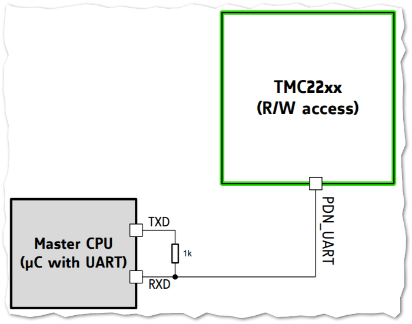

# Stepper Driver

TMC2208 based stepper driver because of

- Silent movement.
- Max 256 µSteps.
- Reduced power consumption while not moving.
- 4.75 - 36V.
- IO 3.3 and 5V
- Configurable via UART.

## TMC2208

- [Schematic](https://github.com/watterott/SilentStepStick/blob/master/hardware/SilentStepStick-TMC2208_v11.pdf) of module from [Watterott](https://shop.watterott.com/).

## Communication

- [Datasheet](https://www.trinamic.com/fileadmin/assets/Products/ICs_Documents/TMC220x_TMC2224_datasheet_Rev1.09.pdf).
- PlatformIO lib: [TMC2208Stepper](https://platformio.org/lib/show/1605/TMC2208Stepper/installation).
- 9 - 500 kBaud without external clock.

## Connection to ESP32

- Using 2x Arduino [SoftwareSerial](https://www.arduino.cc/en/Reference/SoftwareSerial).

Wiring diagram from [TMC2208 datasheet](https://www.trinamic.com/fileadmin/assets/Products/ICs_Documents/TMC220x_TMC2224_datasheet_Rev1.09.pdf).

